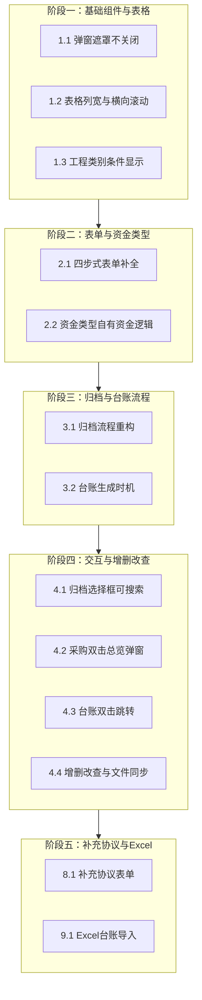

# 山海纳珍录系统开发修改计划

## 一、修改原则

- **修改前**：阅读 PRD/UI 文档中对应章节（3.2、3.3、3.4、3.5 及 UI 3.2.3、3.2.4、3.2.5、3.3、3.4）
- **修改后**：再次阅读文档校验是否满足要求
- **有疑问**：与用户对齐确认

---

## 二、修改模块总览

---

## 三、分项修改计划

### 1. 表格与弹窗（UI 4.2、4.6）

| 序号  | 修改点       | 文档依据                     | 涉及文件                                                                                                                                                                                                           | 实施要点                                                                                 |
| --- | --------- | ------------------------ | -------------------------------------------------------------------------------------------------------------------------------------------------------------------------------------------------------------- | ------------------------------------------------------------------------------------ |
| 1.1 | 弹窗点击遮罩不关闭 | UI 4.6                   | 所有含 `el-dialog` 的 Vue 文件                                                                                                                                                                                       | 为所有 `el-dialog` 添加 `:close-on-click-modal="false"`                                   |
| 1.2 | 表格列宽与横向滚动 | UI 4.2、3.2.1、3.2.3、3.4.1 | [ProjectListView.vue](frontend/src/views/project/ProjectListView.vue)、[ProcurementListView.vue](frontend/src/views/project/ProcurementListView.vue)、[LedgerView.vue](frontend/src/views/ledger/LedgerView.vue) | 合理设置各列 `width`/`min-width`，避免单列过长；表格容器加 `overflow-x: auto` 或 `el-table` 的 `scroll-x` |
| 1.3 | 工程类别条件显示  | PRD 3.1.2、3.1.4          | [ProjectListView.vue](frontend/src/views/project/ProjectListView.vue)                                                                                                                                          | 资金类别=自有资金时：表单隐藏工程类别；清单表工程类别列显示 "-"                                                   |

---

### 2. 四步式表单与资金类型（PRD 3.2、3.6.1，UI 3.2.4）

| 序号  | 修改点        | 文档依据                     | 涉及文件                                                                                                                             | 实施要点                                                                                    |
| --- | ---------- | ------------------------ | -------------------------------------------------------------------------------------------------------------------------------- | --------------------------------------------------------------------------------------- |
| 2.1 | 四步式表单字段补全  | PRD 3.2.4~3.2.6、UI 3.2.4 | [ProcurementListView.vue](frontend/src/views/project/ProcurementListView.vue)、[procurements.py](backend/app/api/procurements.py) | Step2：补全类别、计税方式、合同文本格式等字段；采购预算=控制价/10000；只读字段加复制按钮；Step3：供应商表补全经营范围、税率；Step4：16 个流程时间节点 |
| 2.2 | 资金类型自有资金逻辑 | PRD 3.1.2、3.6.1          | [ProjectListView.vue](frontend/src/views/project/ProjectListView.vue)、[word_service.py](backend/app/services/word_service.py)    | 自有资金下不区分集团内/外；模板路径：自有资金→材料（设备）采购/机械租赁→采购方式（无集团内/外层级）                                    |

---

### 3. 归档与台账流程（PRD 3.4、3.5）

| 序号  | 修改点           | 文档依据            | 涉及文件                                                                                                                                                                     | 实施要点                                                                                                               |
| --- | ------------- | --------------- | ------------------------------------------------------------------------------------------------------------------------------------------------------------------------ | ------------------------------------------------------------------------------------------------------------------ |
| 3.1 | 归档流程重构        | PRD 3.4.1~3.4.4 | [files.py](backend/app/api/files.py)、[ArchiveView.vue](frontend/src/views/archive/ArchiveView.vue)、[procurement_service.py](backend/app/services/procurement_service.py) | **暂存路径**：在归档根目录下创建 `_temp/` 文件夹存放暂存文件，暂存文件存放在各用户电脑（分布式）；台账生成条件满足后：创建采购项目归档专属文件夹、将已上传文件打包移入；五选二需 2 份合同勾选后同时生成 2 条台账 |
| 3.2 | 台账生成时机        | PRD 3.5.1       | [procurements.py](backend/app/api/procurements.py)、[procurement_service.py](backend/app/services/procurement_service.py)                                                 | 采购创建时**不**生成台账；台账仅在归档上传并勾选「此文件为合同文件」时生成                                                                            |
| 3.3 | 采购项目创建不建归档文件夹 | PRD 3.4.2、4.3   | [procurement_service.py](backend/app/services/procurement_service.py)                                                                                                    | 采购流程完成时只创建采购项目专属文件夹，不创建采购项目归档专属文件夹                                                                                 |

---

### 4. 归档页面交互（UI 3.3.1）

| 序号  | 修改点              | 文档依据     | 涉及文件                                                                                               | 实施要点                                                                    |
| --- | ---------------- | -------- | -------------------------------------------------------------------------------------------------- | ----------------------------------------------------------------------- |
| 4.1 | 工程/采购选择框可搜索且显示名称 | UI 3.3.1 | [ArchiveView.vue](frontend/src/views/archive/ArchiveView.vue)                                      | 使用 `el-select` 的 `filterable` 或 `el-autocomplete`；选择后显示工程名、采购项目名（非仅 ID） |
| 4.2 | 归档进度提示           | UI 3.3.1 | [ArchiveView.vue](frontend/src/views/archive/ArchiveView.vue)                                      | 显示「已上传 0/1 份合同」或「已上传 0/2 份合同（五选二）」                                      |
| 4.3 | 文件列表打印方式、删除      | UI 3.3.1 | [ArchiveView.vue](frontend/src/views/archive/ArchiveView.vue)、[files.py](backend/app/api/files.py) | 每行支持单面/双面选择；实现文件删除 API 并同步删除物理文件                                        |

---

### 5. 采购项目清单与智能台账交互（PRD 3.2.7，UI 3.2.3、3.4.1）

| 序号  | 修改点          | 文档依据               | 涉及文件                                                                                              | 实施要点                                        |
| --- | ------------ | ------------------ | ------------------------------------------------------------------------------------------------- | ------------------------------------------- |
| 5.1 | 采购项目双击弹出总览框  | PRD 3.2.7、UI 3.2.3 | [ProcurementListView.vue](frontend/src/views/project/ProcurementListView.vue)                     | 双击采购项弹出弹窗，只读展示四步式表单全部内容（采购方式、项目信息、供应商、流程时间） |
| 5.2 | 台账双击跳转采购项目页  | PRD 3.2.7、UI 3.4.1 | [LedgerView.vue](frontend/src/views/ledger/LedgerView.vue)、[router](frontend/src/router)          | 双击台账行跳转至该合同所属工程的采购项目清单页，并定位到对应采购项           |
| 5.3 | 台账经办人显示姓名、分行 | PRD 3.5.2、UI       | [LedgerView.vue](frontend/src/views/ledger/LedgerView.vue)、[ledger.py](backend/app/api/ledger.py) | 经办人列显示用户名（非数量）；多人时单元格内分行显示                  |
| 5.4 | 台账表补全 19 列   | PRD 3.5.2、UI 3.4.1 | [LedgerView.vue](frontend/src/views/ledger/LedgerView.vue)、[ledger.py](backend/app/api/ledger.py) | 补全：序号、项目实施部门、采购控制价、资金来源、经办人、资金类别、文件（预览按钮）等  |

---

### 6. 增删改查与文件系统一致性（PRD 4.3）

| 序号  | 修改点              | 文档依据    | 涉及文件                                                                                                     | 实施要点                                          |
| --- | ---------------- | ------- | -------------------------------------------------------------------------------------------------------- | --------------------------------------------- |
| 6.1 | 删除工程同步删除文件夹      | PRD 4.3 | [projects.py](backend/app/api/projects.py)、[project_service.py](backend/app/services/project_service.py) | 删除时同步删除工程项目专属文件夹、工程项目归档专属文件夹及子内容              |
| 6.2 | 删除采购项目及文件同步      | PRD 4.3 | 新增 `DELETE /procurements/{id}`、[procurement_service.py](backend/app/services/procurement_service.py)     | 删除采购项目时：删除采购项目专属文件夹；若存在归档文件夹则删除；删除相关台账记录      |
| 6.3 | 归档文件删除           | PRD 4.3 | 新增 `DELETE /files/{id}`、[files.py](backend/app/api/files.py)                                             | 删除归档文件时同步删除物理文件                               |
| 6.4 | 编辑工程/采购项目时文件夹重命名 | PRD 4.3 | [projects.py](backend/app/api/projects.py)、[procurements.py](backend/app/api/procurements.py)            | 工程编号/名称变更时重命名对应文件夹；采购内容等变更时重命名采购项目专属文件夹及归档文件夹 |

---

### 7. 采购项目清单表补全（UI 3.2.3）

| 序号  | 修改点         | 文档依据     | 涉及文件                                                                          | 实施要点                |
| --- | ----------- | -------- | ----------------------------------------------------------------------------- | ------------------- |
| 7.1 | 采购项目清单 10 列 | UI 3.2.3 | [ProcurementListView.vue](frontend/src/views/project/ProcurementListView.vue) | 补全勾选、控制价、备注列；列宽合理设置 |

---

### 8. 补充协议表单（PRD 3.5.4，UI 3.2.5）

| 序号  | 修改点      | 文档依据               | 涉及文件                                                                                                                                                                                                         | 实施要点                                                                                                                     |
| --- | -------- | ------------------ | ------------------------------------------------------------------------------------------------------------------------------------------------------------------------------------------------------------ | ------------------------------------------------------------------------------------------------------------------------ |
| 8.1 | 补充协议表单实现 | PRD 3.5.4、UI 3.2.5 | 新建/扩展 [ProcurementListView.vue](frontend/src/views/project/ProcurementListView.vue)、[procurements.py](backend/app/api/procurements.py)、[procurement_service.py](backend/app/services/procurement_service.py) | 采购方式选择「补充协议」时进入补充协议流程：选择主合同→自动填充主合同信息（工程名称、工程编号、供应商、采购内容、采购控制价、资金来源、主合同编号、原合同价）→用户填写新增金额、补充内容、补充协议日期→保存并生成台账；归档时与主合同同级目录 |

---

### 9. Excel 台账导入（PRD 3.5.5）

| 序号  | 修改点        | 文档依据      | 涉及文件                                                                                                     | 实施要点                                                                        |
| --- | ---------- | --------- | -------------------------------------------------------------------------------------------------------- | --------------------------------------------------------------------------- |
| 9.1 | Excel 台账导入 | PRD 3.5.5 | [LedgerView.vue](frontend/src/views/ledger/LedgerView.vue)、[ledger.py](backend/app/api/ledger.py)、新增导入服务 | 支持导入现有 Excel 台账；自动匹配字段（序号、集团内/外、采购方式、项目编号、合同编号等 19 列）；缺失字段用 "/" 填充；导入后写入台账表 |

---

## 四、实施顺序建议

1. **阶段一**：1.1 弹窗、1.2 表格、1.3 工程类别（影响面小，可快速完成）
2. **阶段二**：2.1 四步式表单、2.2 资金类型（表单与模板逻辑）
3. **阶段三**：3.1~3.3 归档与台账流程（核心业务逻辑，含暂存路径设计）
4. **阶段四**：4.1~~4.3 归档交互、5.1~~5.4 采购与台账交互
5. **阶段五**：6.1~6.4 增删改查与文件同步、7.1 采购清单表补全
6. **阶段六**：8.1 补充协议表单、9.1 Excel 台账导入

---

## 五、已确认的设计决策

1. **归档暂存路径**：在归档功能的根目录创建 `_temp/` 文件夹用于存放暂存文件；暂存文件存放在各用户电脑（分布式存储架构下，每个用户电脑的归档根目录下均有 `_temp/`）。
2. **补充协议表单**：纳入本次计划，按 PRD 3.5.4 完整实现（主合同选择、自动填充、补充内容填写、归档关联）。
3. **Excel 导入**：纳入本次计划，按 PRD 3.5.5 实现导入现有 Excel 台账，自动匹配字段，缺失字段用 "/" 填充。

