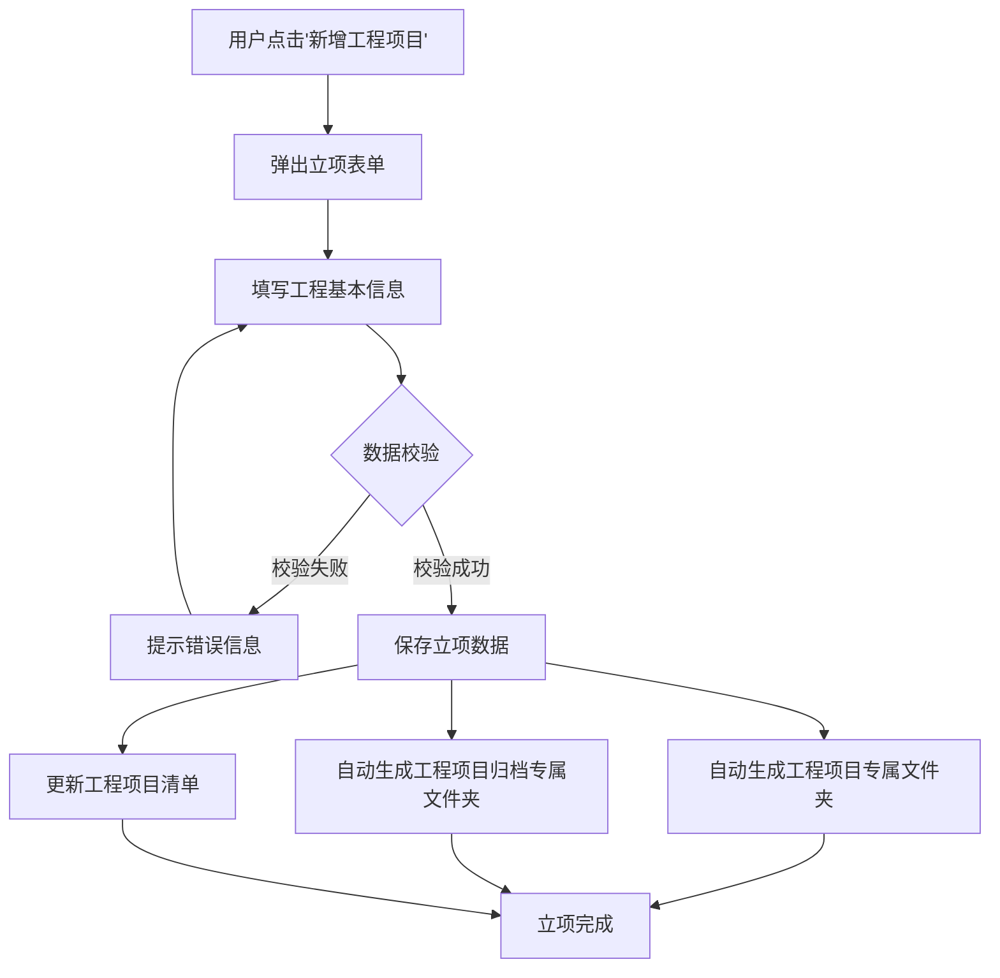
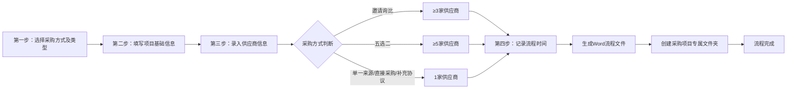
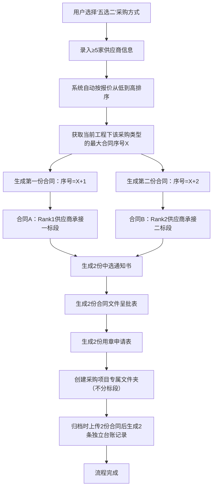
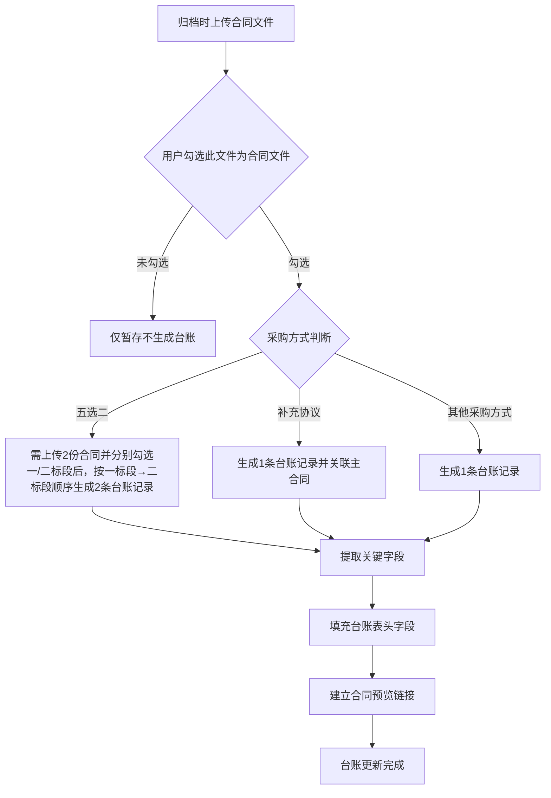

# 采购流程办公系统 - 产品需求文档（最终完整版）

> **部署与存储（现行）**：交付默认为 **集中式**——在 **运行主后端（端口 8000）的服务器** 上保存 **SQLite 数据库** 与 **`backend/data`** 下的流程文件、归档与上传文件；用户通过局域网浏览器访问该服务器。下文若出现历史「分布式 / 各电脑存储」等表述，以实现与 [README](../README.md)、[deploy-packaged.md](../docs/deploy-packaged.md) 为准。

## 一、项目概述

### 1.1 背景与痛点
- **工作痛点**：
  - 采购管理员手动编制各种Word模板审批表（单），工作效率慢、常干"复制\粘贴"的信息填写工作，重复性强，工作效率低
  - 工作过程中产生的文件多且杂，容易混乱出错
  - 归档期间需手动录入台账，归档文件难以科学管理
  - 文件命名混乱，查找困难，无法快速定位

- **业务目标**：
  - 将线下分散、重复、易错的手工操作，转化为线上一条连续、规范、可追溯的数字化流水线
  - 实现"一处录入，全程使用；一次归档，全局了然"
  - 一站式录入信息、生成标准化的线下审批单
  - 规范管理工作中和归档时产生的文件，按规则自动命名、创建文件夹及文件
  - 自动从流程中提取关键数据，生成并更新合同台账，避免二次手工录入
  - 合同扫描件上传后自动关联到台账对应项目

### 1.2 产品目标
- **核心目标**：为采购管理员设计的小组办公（5人左右）办公系统，专注"工程类采购"全流程数字化，严格遵循线下审批流程
- **量化指标**：
  - 不同文件内相同的字段只填写1次，不重复填写
  - 文件夹及文件命名0手动
  - 台账生成0手动
  - 工作效率提高70%
  - 工作出错率实现0%
  - 低配置运行：i3/4GB内存即可流畅运行

### 1.3 范围界定
- **不生成新模板**：仅使用现有Word模板
- **不替代线下签字审批流程**：系统仅处理线上流程，线下签字流程保持不变
- **仅处理"工程类采购"**：不涉及行政、IT采购等
- **不包含**：总包合同签订及管理、分包合同签订及管理、劳务合同签订及管理（这些将作为未来迭代方向）

## 二、用户角色与权限矩阵

| 角色 | 职责 | 权限 | 详细说明 |
|------|------|------|----------|
| **采购管理员** | 工程立项、创建采购项目、归档资料、使用台账 | **查看权限**：可查看所有工程项目及采购项目数据**操作权限**：仅能对自己经办的工程项目及其下的采购项目进行增删改操作**导出权限**：可导出台账数据**限制**：对于非本用户经办的工程项目及其下的采购项目，仅能查看，不能删改 | 权限基于工程项目的"材料（设备）采购经办人（可多选）"字段判定。系统自动识别当前登录用户是否在该项目经办人列表中，若在则开放编辑权限，否则仅显示只读视图 |
| **系统管理员** | 工程立项、创建采购项目、归档资料、使用台账、系统配置 | **查看权限**：可查看所有数据**操作权限**：能查看、删改所有数据，包括其他用户经办的项目**管理权限**：可维护Word模板、配置系统参数、管理用户账号**导出权限**：可导出台账及所有报表 | 拥有系统最高权限，可管理所有项目和数据，负责系统日常维护和模板更新 |

### 2.1 权限控制逻辑
```
IF 当前用户 IN 项目.材料（设备）采购经办人列表 OR 当前用户角色 == "系统管理员" THEN
    允许执行：创建、编辑、删除、归档操作
ELSE
    仅允许执行：查看、导出操作
END IF
```

## 三、核心功能需求（模块化）

### 3.1 工程项目管理

#### 3.1.1 工程立项流程图


#### 3.1.2 工程立项功能详情
- **功能描述**：提供引导式表单，填写（包括：填空、勾选、下拉选择）即可，并形成"工程项目清单"
- **字段列表**：
  | 字段名 | 类型 | 选项 | 说明 | 系统自动填充 |
  |--------|------|------|------|--------------|
  | 资金类别 | 下拉选择 | 工程类/自有资金 | 用户选择 | 无 |
  | 工程类别 | 下拉选择 | 集团内项目/集团外项目 | 用户选择 | **仅当资金类别=工程类时显示**；资金类别=自有资金时**不显示**，自有资金下无集团内/外区分 |
  | 项目编号 | 文本 | 无 | 用户输入 | 无 |
  | 工程编号 | 文本 | 无 | 用户输入 | 无 |
  | 工程名称 | 文本 | 无 | 用户输入 | 无 |
  | 项目实施部门 | 文本 | 无 | 用户输入 | 无 |
  | 项目现场管理员 | 文本 | 无 | 用户输入 | 无 |
  | 项目现场管理员联系方式 | 文本 | 无 | 用户输入 | 无 |
  | 发包单位 | 文本 | 无 | 用户输入 | 无 |
  | 发包方联系人 | 文本 | 无 | 用户输入 | **非必填**；无格式校验 |
  | 发包方联系方式 | 文本 | 无 | 用户输入 | **非必填**；无格式校验 |
  | 总包合同价 | 数值 | 无 | 用户输入 | 无 |
  | 工程工期 | 文本 | 无 | 用户输入 | 无 |
  | 资金来源 | 下拉选择 | 财政资金/企业自筹/自有资金/部分自有资金、部分财政资金/其他 | 用户选择 | 无 |
  | 项目地址 | 文本 | 无 | 用户输入 | 无 |
  | 材料（设备）采购经办人（可多选） | 多选 | 用户列表 | 可配置多个经办人，共同拥有该工程项目及其下采购项目的编辑/归档权限 | 无 |
  | 创建日期 | 日期 | 无 | 系统自动填充 | 当前日期 |

#### 3.1.3 文件夹管理及命名规则
- **工程项目专属文件夹**：
  - 规则：`工程编号 + 空格 + 工程名称`
  - 示例：`专机25-10N 办公楼改造工程`
  - 用途：用于存放该工程的采购项目专属文件夹及补充协议专属文件夹

- **工程项目归档专属文件夹**：
  - 规则：`工程编号 + 材料（设备）合同`
  - 示例：`专机25-10N材料（设备）合同`
  - 用途：用于存放该工程的采购项目归档专属文件夹及补充协议归档专属文件夹

- **命名规则约束**：
  - 严禁将"工程项目专属文件夹"与"工程项目归档专属文件夹"置于同一父级目录下
  - 系统需实施全局命名约束，检测到新建文件夹名称重复时立即触发拦截
  - 文件夹创建需在工程立项成功后自动完成

#### 3.1.4 工程项目清单
- **功能描述**：自动抓取立项表单数据，生成工程项目清单；左导航「工程项目管理」入口直接进入
- **工程类别显示规则**：当资金类别=自有资金时，工程类别列显示"-"（不适用）；当资金类别=工程类时，显示集团内项目/集团外项目
- **经办人列显示规则**：显示**姓名（real_name）**，**禁止**显示经办人数量（如"3人"）；多位经办人时在单元格内分行显示（每人一行）
- **清单表头字段**：
  | 序号 | 资金类别 | 工程类别 | 项目编号 | 工程编号 | 工程名称 | 项目实施部门 | 项目现场管理员 | 项目现场管理员联系方式 | 发包单位 | 发包方联系人 | 发包方联系方式 | 总包合同价 | 工程工期 | 资金来源 | 材料（设备）采购经办人（可多选） | 创建日期 |
  |------|----------|----------|----------|----------|----------|--------------|----------------|------------------------|----------|--------------|----------------|------------|----------|----------|------------------------|----------|
  | 空值显示 | — | — | — | — | — | — | — | — | — | 无数据时显示「-」 | 无数据时显示「-」 | — | — | — | — | — |
  | 导出 Excel | — | — | — | — | — | — | — | — | — | **须包含**，与表单同步 | **须包含**，与表单同步 | — | — | — | — | — |

### 3.2 合同业务流程与文件生成

#### 3.2.1 采购业务流程总览图


#### 3.2.2 "四步式"智能表单填写
- **系统逻辑**：按四个维度判定确定调用的表单及流程模板
  - 一：资金类别（继承自工程项目立项）
  - 二：工程类别（继承自工程项目立项）
  - 三：采购类型（用户选择：材料采购/材料租赁/设备采购/机械租赁）
  - 四：采购方式（用户选择：邀请询比/单一来源/直接采购/补充协议/五选二）

#### 3.2.3 第一步：选择采购方式及采购类型
- **字段映射**：
  | 字段名 | Word占位符 | 类型 | 选项 | 说明 |
  |--------|------------|------|------|------|
  | 资金类别 | {{gongcheng_or_ziyou}} | 文本（只读） | 无 | 继承工程项目立项的值 |
  | 工程类别 | {{in_or_out}} | 文本（只读） | 无 | 继承工程项目立项的值 |
  | 采购类型 | {{caigou_leixing}} | 下拉选择 | 材料采购/材料租赁/设备采购/机械租赁 | 用户选择 |
  | 采购方式 | {{caigou_fangshi}} | 下拉选择 | 邀请询比/单一来源/直接采购/补充协议/五选二 | 用户选择 |

#### 3.2.4 第二步：采购项目基础信息
- **字段映射**：
  | 字段名 | Word占位符 | 类型 | 选项 | 说明 |
  |--------|------------|------|------|------|
  | 采购类型 | {{caigou_leixing}} | 文本（只读） | 无 | 继承第一步的值 |
  | 类别 | {{leibie}} | 单选按钮 | [ ]专业分包类 [ ]劳务分包类 [✓]材料物资类 [ ]设备租赁类 [ ]服务类 | 仅可选其一 |
  | 采购方式 | {{caigou_fangshi}} | 文本（只读） | 无 | 继承第一步的值 |
  | 工程名称 | {{gong_cheng_ming}} | 只读输入框 + 复制按钮 | 无 | 继承工程项目立项的值 |
  | 项目编号 | {{xiangmu_bianhao}} | 只读输入框 + 复制按钮 | 无 | 继承工程项目立项的值 |
  | 工程编号 | {{gongcheng_bianhao}} | 只读输入框 + 复制按钮 | 无 | 继承工程项目立项的值 |
  | 发包单位 | {{yezhu}} | 只读输入框 + 复制按钮 | 无 | 继承工程项目立项的值 |
  | 总包合同价 | {{zongbaojia}} | 只读输入框 + 复制按钮 | 无 | 继承工程项目立项的值 |
  | 项目地址 | {{xiangmu_dizhi}} | 只读输入框 + 复制按钮 | 无 | 继承工程项目立项的值 |
  | 项目实施部门 | {{xiangmubu}} | 只读输入框 + 复制按钮 | 无 | 继承工程项目立项的值 |
  | 项目现场管理员 | {{xianchang_guanliren}} | 只读输入框 + 复制按钮 | 无 | 继承工程项目立项的值 |
  | 项目现场管理员联系方式 | {{xianchang_guanli_dianhua}} | 只读输入框 + 复制按钮 | 无 | 继承工程项目立项的值 |
  | 采购项目名称 | {{caigou_xiangmu_ming}} | 文本 | 无 | 用户输入 |
  | 采购内容 | {{caigou_neirong}} | 文本 | 无 | 用户输入 |
  | 控制价 | {{kongzhijia}} | 数值 | 无 | 用户输入 |
  | 采购预算 | {{caigou_yusuan}} | 数值 | 无 | 从控制价除以10000，四舍五入 |
  | 计税方式 | {{jishui_fangshi}} | 单选按钮 | [✓]一般计税方法计算 [ ]简易计税方法计算 | 仅可选其一 |
  | 合同文本格式 | {{hetong_wenben_geshi}} | 单选按钮 | [ ]采用公司印发的合同标准文本编制 [✓]采用非公司印发的合同标准文本编制 | 仅可选其一 |
  | 合同是否使用公司标准范本 | {{hetong_fanben}} | 单选按钮 | [✓]是 [ ]否，但合同已经过法律审核，并有相关证明资料 | 仅可选其一 |
  | 是否经过公司招采程序 | {{zhaocai_chengxu}} | 单选按钮 | [✓]是 [ ]否，原因：/ | 仅可选其一 |
  | 是否经过审核校对 | {{shenhe_jiaodui}} | 单选按钮 | [✓]是 [ ]否 | 仅可选其一 |
  | 公告日期年份 | {{gonggao_year}} | 文本 | 无 | 用户输入 |
  | 公告日期月份 | {{gonggao_month}} | 文本 | 无 | 用户输入 |
  | 公告日期日 | {{gonggao_day}} | 文本 | 无 | 用户输入 |
  | 意向报名截止年份 | {{yixiang_baoming_jiezhi_year}} | 文本 | 无 | 用户输入 |
  | 意向报名截止月份 | {{yixiang_baoming_jiezhi_month}} | 文本 | 无 | 用户输入 |
  | 意向报名截止日 | {{yixiang_baoming_jiezhi_day}} | 文本 | 无 | 用户输入 |
  | 交易文件封面年份 | {{jiaoyi_fengmian_year}} | 文本 | 无 | 用户输入 |
  | 交易文件封面月份 | {{jiaoyi_fengmian_month}} | 文本 | 无 | 用户输入 |
  | 交易文件年份 | {{jiaoyi_wenjian_year}} | 文本 | 无 | 用户输入 |
  | 交易文件月份 | {{jiaoyi_wenjian_month}} | 文本 | 无 | 用户输入 |
  | 交易文件日 | {{jiaoyi_wenjian_day}} | 文本 | 无 | 用户输入 |
  | 交易文件获取截止年份 | {{jiaoyi_wenjian_huoqv_jiezhi_year}} | 文本 | 无 | 用户输入 |
  | 交易文件获取截止月份 | {{jiaoyi_wenjian_huoqv_jiezhi_month}} | 文本 | 无 | 用户输入 |
  | 交易文件获取截止日 | {{jiaoyi_wenjian_huoqv_jiezhi_day}} | 文本 | 无 | 用户输入 |
  | 响应文件递交截止年份 | {{xiangying_dijiao_jiezhi_year}} | 文本 | 无 | 用户输入 |
  | 响应文件递交截止月份 | {{xiangying_dijiao_jiezhi_month}} | 文本 | 无 | 用户输入 |
  | 响应文件递交截止日 | {{xiangying_dijiao_jiezhi_day}} | 文本 | 无 | 用户输入 |
  | 合同签订时间 | {{qianding_shijian}} | 文本 | 无 | 用户输入 |

- **五选二增加的字段映射**：
  | 字段名 | Word占位符 | 类型 | 选项 | 说明 |
  |--------|------------|------|------|------|
  | 一标段名 |{{biaoduanming1}} | 文本 | 无 | 用户输入 |
  | 二标段名 |{{biaoduanming2}} | 文本 | 无 | 用户输入 |
  | 控制价标1 | {{kongzhijia_biao1}} | 数值 | 无 | 用户输入 |
  | 控制价标2 | {{kongzhijia_biao2}} | 数值 | 无 | 用户输入 |
  
#### 3.2.5 第三步：供应商信息
- **规则**：
  - 邀请询比：≥3家
  - 五选二：≥5家
  - 单一来源、直接采购、补充协议：1家
- **界面录入要求**：
  - 供应商列表表格中，**供应商、联系人、联系方式、经营范围、税率、含税报价（元）**等列必须为**可编辑的输入框**，用户可直接在表格内录入各供应商的详细信息。
  - 支持添加、删除供应商行；每行各字段均需支持用户输入。
- **成交金额展示**（表格下方，系统自动计算）：
  - **常规模式**（直接采购、单一来源、邀请询比、补充协议）：系统根据供应商含税报价升序排序，**最低价供应商的报价**即为成交金额。展示：成交金额（数值）、成交金额（大写）。
  - **五选二模式**：系统根据报价排序，**第一名（最低价）**为成交金额1，**第二名（次低价）**为成交金额2。展示：成交金额1、成交金额1（大写）、成交金额2、成交金额2（大写）。
- **字段映射**：
  | 字段名 | Word占位符 | 类型 | 选项 | 说明 |
  |--------|------------|------|------|------|
  | 供应商数量 | {{gongyingshang_count}} | 数值 | 无 | 用户输入（保护值：1） |
  | 供应商1 | {{gongyingshang1}} | 文本 | 无 | 用户输入 |
  | 供应商2 | {{gongyingshang2}} | 文本 | 无 | 用户输入 |
  | 供应商3 | {{gongyingshang3}} | 文本 | 无 | 用户输入 |
  | 联系人1 | {{lianxiren1}} | 文本 | 无 | 用户输入 |
  | 联系人2 | {{lianxiren2}} | 文本 | 无 | 用户输入 |
  | 联系人3 | {{lianxiren3}} | 文本 | 无 | 用户输入 |
  | 联系电话1 | {{lianxi_dianhua1}} | 文本 | 无 | 用户输入 |
  | 联系电话2 | {{lianxi_dianhua2}} | 文本 | 无 | 用户输入 |
  | 联系电话3 | {{lianxi_dianhua3}} | 文本 | 无 | 用户输入 |
  | 经营范围1 | {{jingying_fanwei1}} | 文本 | 无 | 用户输入 |
  | 经营范围2 | {{jingying_fanwei2}} | 文本 | 无 | 用户输入 |
  | 经营范围3 | {{jingying_fanwei3}} | 文本 | 无 | 用户输入 |
  | 税率1 | {{shuilv1}} | 文本 | 无 | 用户输入 |
  | 税率2 | {{shuilv2}} | 文本 | 无 | 用户输入 |
  | 税率3 | {{shuilv3}} | 文本 | 无 | 用户输入 |
  | 含税报价1 | {{baojia1}} | 数值 | 无 | 用户输入 |
  | 含税报价2 | {{baojia2}} | 数值 | 无 | 用户输入 |
  | 含税报价3 | {{baojia3}} | 数值 | 无 | 用户输入 |
  | 排名第1供应商 | {{rank1}} | 文本 | 无 | 系统自动生成（最低报价） |
  | 排名第2供应商 | {{rank2}} | 文本 | 无 | 系统自动生成 |
  | 排名第3供应商 | {{rank3}} | 文本 | 无 | 系统自动生成（最高报价） |
  | 成交金额 | {{chengjiao_jine}} | 数值 | 无 | {{rank1}}供应商对应的报价金额 |
  | 成交金额（大写） | {{chengjiao_jine_daxie}} | 文本 | 无 | 把{{chengjiao_jine}}转换成大写金额数字，**展示至分**（元、角、分） |

- **大写金额规则**（修正 2026-03）：所有大写金额展示至「分」，如 123.45 元 → 壹佰贰拾叁元肆角伍分，123 元 → 壹佰贰拾叁元整。

- **五选二增加的字段映射**：
  | 字段名 | Word占位符 | 类型 | 选项 | 说明 |
  |--------|------------|------|------|------|
  | 成交金额1 | {{chengjiao_jine1}} | 数值 | 无 | {{rank1}}供应商（第一名/最低价）对应的报价金额 |
  | 成交金额1（大写） | {{chengjiao_jine_daxie1}} | 文本 | 无 | 把{{chengjiao_jine1}}转换成大写金额数字，展示至分 |
  | 成交金额2 | {{chengjiao_jine2}} | 数值 | 无 | {{rank2}}供应商（第二名/次低价）对应的报价金额 |
  | 成交金额2（大写） | {{chengjiao_jine_daxie2}} | 文本 | 无 | 把{{chengjiao_jine2}}转换成大写金额数字，展示至分 |

- **五选二采购清单**（修正 2026-03）：供应商、合同价分行显示两标段（无前缀）；一标段合同价=成交金额1，二标段合同价=成交金额2；合同价保留两位小数，不四舍五入为整数。 

#### 3.2.6 第四步：流程时间记录
- **功能**：用户可编辑的时间日期记录表单，智能表单保存时自动生成"目录.docx"
- **目录.docx 标题格式**：宋体、四号、居中
- **表头命名规则**：补充协议为「工程编号+工程名+采购内容+补充协议X」（X由主合同已有补充协议数量+1）；其他采购方式为「工程编号+工程名+采购内容」
- **时间记录表**：
  | 序号 | 流程 | 日期（用户输入） |
  |------|------|----------------|
  | 1 | 采购意向公告 | 用户输入 |
  | 2 | 采购意向公告上网审批表 | 用户输入 |
  | 3 | 意向报名截止日期 | 用户输入 |
  | 4 | 交易文件 | 用户输入 |
  | 5 | 交易文件审核表 | 用户输入 |
  | 6 | 响应文件接收函 | 用户输入 |
  | 7 | 响应文件递交截止日期 | 用户输入 |
  | 8 | 供应商推荐表 | 用户输入 |
  | 9 | 询比/单源采购会议通知 | 用户输入 |
  | 10 | 供应商资格审查表 | 用户输入 |
  | 11 | 询比\单源\直接采购记录及结果呈批表 | 用户输入 |
  | 12 | 中选通知书 | 用户输入 |
  | 13 | 合同文件呈批表 | 用户输入 |
  | 14 | 用章申请表 | 用户输入 |
  | 15 | 合同签订 | 用户输入 |
  | 16 | 阳光采购平台公布结果 | 用户输入 |

#### 3.2.7 采购项目清单与总览
- **采购项目清单**：左导航「材料（设备）业务」入口直接进入；页面顶部为**工程项目选择框**（下拉+可搜索，参考归档管理「工程」选择框）；**每次进入不默认选中**，需手动选择；未选时框内显示「请先选择工程项目」、操作按钮禁用、表格区域空白；选择工程后展示该工程下所有采购项目；支持增删改查、导出、分页；**移除**原「采购项目清单 - 工程名称」标题及「返回工程清单」按钮；采购项目搜索框位于页面右上角；URL 不带工程 ID
- **工程项目选择框技术约束**（修正 2026-03）：工程项目选择框需同时支持**搜索**与**选择**——用户可在输入框中输入关键词进行远程搜索（调用后端 API 按工程编号/名称模糊查询），并从搜索结果中选择；需同时启用 `filterable`（可输入搜索）与 `remote`（远程拉取）；工程列表加载失败时需**明确提示**用户；从工程项目清单**双击进入**或从智能台账跳转时，URL 携带 `project_id`，页面需**预选并显示**该工程在选择框中
- **双击采购项弹出总览框**：用户**双击**采购项目清单中的任意采购项时，系统弹出**总览弹窗**，展示该采购项目"四步式"表单所填写的**全部内容**（第一步采购方式及采购类型、第二步采购项目基础信息、第三步供应商信息、第四步流程时间记录），以只读形式完整呈现，便于快速查看
- **智能台账双击跳转**：用户**双击**智能台账中的任意台账项时，系统跳转至**材料（设备）业务**页，自动选中该合同所属工程并定位到对应采购项；跳转逻辑不变

### 3.3 "五选二"模式特殊处理详解

#### 3.3.1 "五选二"模式业务流程图


**采购项目清单与台账区分**（修正 2026-03）：
- **采购项目清单**：五选二模式在采购项目清单中**仅生成 1 条采购项目记录**，不按标段拆分；备注栏**不需注明**一标段或二标段。
- **智能台账**：归档上传 2 份合同后仍生成 **2 条台账记录**（一标段、二标段各 1 条）。

**实现约束**（供开发参考）：
- 采购项目列表接口 `list_procurements` 需支持参数 `for_list`（默认 True）：`for_list=True` 时，五选二仅返回一标段记录、二标段不返回，且 `remark` 字段为空；`for_list=False` 时供归档等场景使用。
- 采购项目清单页调用 `listProcurements(projectId, true)` 或等效传参，确保只展示 1 条五选二。
- **五选二新增**：项目信息页中公告日期、意向报名截止日期、交易文件封面年月、交易文件日期、交易文件获取截止日期、响应文件递交截止日期、合同签订时间等日期字段初始为空白。
- **采购清单**：供应商、合同价列随供应商报价及排名变更而更新（按报价升序取第一名作为中选人）。

#### 3.3.2 "五选二"模式核心逻辑算法
1. **排序逻辑**：
   - 系统自动将5家（或更多）供应商按含税报价从低到高排序
   - 第1名 (Rank1) → 对应逻辑上的"第一中标人"（一标段，金额较大）
   - 第2名 (Rank2) → 对应逻辑上的"第二中标人"（二标段，金额较小）

2. **编号生成规则**（修正 2026-03）：
   - 合同编号在**归档上传合同文件并触发台账生成时**分配，非创建采购项目时分配。
   - 查询当前工程下该采购类型（如"材"）的最大现有序号，记为 `X`（按已分配编号递增，不回收）。
   - **记录A（一标段）编号** = `工程编号` + `-` + `采购类型代码` + `(X+1)`
   - **记录B（二标段）编号** = `工程编号` + `-` + `采购类型代码` + `(X+2)`（五选二必须连号）

3. **字段映射详情**：
   | 字段名 | 记录A(Rank1)取值逻辑 | 记录B(Rank2)取值逻辑 | 备注 |
   |--------|---------------------|---------------------|------|
   | 合同编号 | `工程编号`+-+`采购类型代码`+ (X+1) | `工程编号`+-+`采购类型代码`+ (X+2) | 连续递增 |
   | 中选供应商 | 取排序后第1名供应商名称 | 取排序后第2名供应商名称 | 自动抓取 |
   | 成交金额 | 取排序后第1名的报价 | 取排序后第2名的报价 | 自动抓取 |
   | 签订日期 | 当前系统提交日期 | 当前系统提交日期 | 两者必须完全一致 |
   | 一标段名称 | 用户输入的一标段名 | / | 仅记录A有值 |
   | 二标段名称 | / | 用户输入的二标段名 | 仅记录B有值 |
   | 其他通用字段 | 复制主数据（工程名、内容等） | 复制主数据（工程名、内容等） | 保持一致 |

#### 3.3.3 "五选二"模式详细示例说明

**场景设定**：
- 工程编号：`专机26-01N`
- 采购类型：材料采购（代号：`材`）
- 当前台账状态：已有 `专机26-01N-材1`、`专机26-01N-材2` 两条记录（即 X=2）
- 本次采购：混凝土材料"五选二"模式采购
- 一标段名称：`混凝土供应（大标）`
- 二标段名称：`混凝土供应（小标）`

**供应商报价数据**：
| 排名 | 供应商名称 | 含税报价（元） | 联系人 | 联系电话 |
|------|-----------|--------------|--------|----------|
| 1 | 广州建材有限公司 | 100,000 | 张三 | 13800138001 |
| 2 | 南方建材公司 | 105,000 | 李四 | 13800138002 |
| 3 | 东方建材厂 | 110,000 | 王五 | 13800138003 |
| 4 | 北方建材集团 | 115,000 | 赵六 | 13800138004 |
| 5 | 中部建材公司 | 120,000 | 孙七 | 13800138005 |

**系统处理过程**：
1. **序号计算**：
   - 当前最大序号 X = 2
   - 第一份合同序号 = X + 1 = 3
   - 第二份合同序号 = X + 2 = 4

2. **合同编号生成**：
   - 合同A（一标段）编号：`专机26-01N-材3`
   - 合同B（二标段）编号：`专机26-01N-材4`

3. **台账记录生成**：
   （台账记录内容同前，保持不变）

4. **文件夹命名**（采购流程仅创建采购项目专属文件夹，**不**创建采购项目归档专属文件夹）：
   - **采购项目专属文件夹**：`专机26-01N-混凝土`（规则：工程编号-采购内容；若同工程同采购内容重复，则为 `工程编号-采购内容2/3/...`）
   - **采购项目归档专属文件夹**：在归档时台账生成后再创建，命名规则见 3.4 归档管理

5. **生成文件清单**：
   - 《中选通知书》× 2份（分别对应广州建材、南方建材）
   - 《合同文件呈批表》× 2份
   - 《用章申请表》× 2份
   - 《目录.docx》× 1份 

#### 3.3.4 "五选二"模式文件及文件夹管理

**采购流程仅创建采购项目专属文件夹，不创建采购项目归档专属文件夹**。采购项目归档专属文件夹在归档时台账生成后再创建，命名规则见 3.4 归档管理。

- **采购项目专属文件夹命名规则**：
  - 规则：`工程编号-采购内容`
  - 若同一工程下出现重复采购内容，命名为：`工程编号-采购内容X`（`X` 从 2 递增）
  - 示例：`专机26-01N-混凝土`、`专机26-01N-混凝土2`、`专机26-01N-混凝土3`
  - 用途：用于存放该采购项目生成的WORD流程文件及合同范本（两套流程文件存于同一文件夹）

#### 3.3.5 “四步式”智能表单需求功能

**表单暂存功能**（已移除 2026-03）
- 系统需支持表单“暂存”操作，用户可临时保存表单数据，下次打开时自动恢复；一旦触发暂存，系统必须立即生成该项目的“专属文件夹”及全套配套流程文件（此时文件内容可保留模板状态或占位符），确保下次用户继续完善表单时，系统能基于已生成的文件夹和文件结构，同步更新并完善所有相关流程文档的内容。**注**：采购流程仅创建采购项目专属文件夹，不创建采购项目归档专属文件夹。

**映射归并逻辑**
- 系统需支持表单内容映射归并逻辑，即：无论用户选择的是“材料采购”还是“设备采购”，后台均统一指向并调用第三维度目录下的“材料（设备）采购”分类，自动加载该路径下对应的流程文件模板。
- 用户选择“材料租赁”时，后台指向第三维度目录下的 **“材料租赁”** 分类（与“材料（设备）采购”并列；合同编号与材料采购共用 **材X** 序号池，见 8.3）。

### 3.4 归档管理

#### 3.4.1 文件上传流程图
```mermaid
graph TD
    A[用户进入归档界面] --> B[选择对应工程项目]
    B --> C[选择采购项目或补充协议]
    C --> D[拖拽或点击上传扫描文件]
    D --> E{用户标识文件类型}
    E -->|勾选"此文件为合同文件" | F[系统标记为合同扫描件并暂存]
    E -->|未勾选 | G[系统标记为普通归档文件并暂存]
    F --> H{台账生成条件满足}
    G --> H
    H -->|是| I[创建采购项目归档专属文件夹]
    I --> J[将已上传文件打包移入该文件夹]
    J --> K[建立台账预览链接]
    K --> L[归档完成]
    H -->|否| M[归档完成，文件保持暂存]
```

#### 3.4.2 归档流程说明

**采购项目归档专属文件夹创建时机**：创建采购项目时**不**生成采购项目归档专属文件夹；待归档文件上传完毕且台账生成后，再创建采购项目归档专属文件夹，用于打包之前上传的归档扫描文件。

- **上传阶段**：用户上传的归档文件先暂存于系统指定位置（如工程项目归档专属文件夹下的临时区，按采购项目标识关联）
- **台账生成条件**：常规/补充协议需上传1份并勾选"合同文件"；五选二需上传2份并分别勾选"一标段合同文件"和"二标段合同文件"
- **文件夹创建与打包**：台账生成后，系统创建采购项目归档专属文件夹（命名规则见下文），将已上传的该采购项目所有归档文件移动/打包至该文件夹

#### 3.4.3 采购项目归档专属文件夹命名规则

- **常规采购**：`工程编号-采购类型X`，示例：`专机26-01N-材1`
- **五选二**：`工程编号-采购类型X、采购类型(X+1)`，示例：`专机26-01N-材1、材2`；**一标段、二标段两份合同文件均归档至同一文件夹内**
- **补充协议**：`工程编号-采购类型X-补Y`，示例：`专机26-01N-材1-补1`

#### 3.4.4 文件上传功能详情
- **功能**：可上传（拖拽上传）扫描文件。
- **存放路径**：台账生成前，文件暂存于系统指定位置；台账生成后，文件存放于该工程 **"工程项目归档专属文件夹"** 下的 **"采购项目归档专属文件夹"** 或 **"补充协议归档专属文件夹"**。
- **文件类型标识功能**：
  - **常规采购/补充协议**：提供复选框 **[✓] 此文件为合同文件**。
  - **五选二模式**（修正 2026-03）：提供两个复选框 **[✓] 此文件为一标段合同文件**、**[✓] 此文件为二标段合同文件**；用户上传时需分别勾选，系统将文件关联到对应标段的台账记录。
  - **逻辑**：
    - 若用户勾选：系统将该文件识别为正式合同/补充协议扫描件，自动在智能台账的对应记录中建立“合同预览”链接，并优先展示。
    - 若用户未勾选：系统将该文件视为普通过程资料（如资质证明、会议纪要等），仅存入归档文件夹，不自动关联台账的合同预览列。
  - **目的**：减少系统自动识别发生错误的概率，确保台账关联的准确性。
- **文件重名检测**（修正 2026-03）：上传时检测当前采购项目归档文件夹内是否已存在同名文件；若存在则提示用户并拒绝上传，避免覆盖。
- **删除后重新上传防重复**（修正 2026-03）：删除已勾选为合同文件的归档文件时，系统同步解除该文件与台账记录的关联（或删除对应台账记录）；用户重新上传并勾选合同文件时，若该采购项目+标段已有台账记录，应**更新**其文件关联而非新建台账，避免生成重复台账。
- **其他规则**：
  - 文件命名保持原样，不进行修改。
  - 支持批量上传、批量下载。

### 3.5 智能台账管理

#### 3.5.1 台账生成流程图

**台账生成时机**：台账在**归档时**上传合同文件并勾选"此文件为合同文件"时生成，**非**采购流程完成时生成。



#### 3.5.2 台账自动生成
- **功能**：系统在归档上传合同文件并勾选"此文件为合同文件"（五选二为"一标段合同文件"/"二标段合同文件"）时，从流程表单中提取"合同金额"、"供应商"、"签订日期"等信息，生成并更新合同台账
- **五选二台账生成顺序**（修正 2026-03）：生成顺序为**一标段先、二标段后**
- **台账表头字段**（共22个，不含「文件」栏；合同预览通过合同编号/所属主合同/补充协议点击实现；资金类别在集团内/外前；最后一列为录入时间）：
  | 序号 | 资金类别 | 集团内/外项目 | 采购方式 | 项目实施部门 | 项目编号 | 合同编号 | 工程名称 | 采购项目名称 | 供应商 | 供应商联系人 | 供应商联系方式 | 合同价（元） | 签订日期 | 采购内容 | 其余参与方 | 采购控制价（元） | 资金来源 | 经办人 | 所属主合同 | 补充协议 | 录入时间 |
  |------|----------|--------------|----------|--------------|----------|----------|----------|--------------|--------|--------------|--------------|--------------|----------|----------|------------|------------------|----------|--------|----------|----------|----------|
  | **其余参与方** | 同一单元格内**换行**列出非中标供应商**名称**（仅名称）。邀请询比：除**按成交金额规则确定的中标者**外其余供应商全部列入；五选二：本标段 5 家中去掉**本标段中标 1 家**，剩余 4 家名称全部列入；**直接采购、单一来源、补充协议**仅一家供应商时本列固定为「/」。某行供应商名称为空时仍占**一行空白**。 |
  | **供应商联系人/联系方式** | 与本条台账「供应商」一致的中标单位在采购供应商表中的「联系人」「联系方式」。五选二两条台账分别对应本条「供应商」的联系人及电话。 |
  | **同步规则**（2026-03） | 采购项目中供应商信息、报价及排名变更后，台账中**供应商、供应商联系人、供应商联系方式、合同价、其余参与方**等与成交结果相关的字段**始终与当前采购数据同步**（与 PRD 8.9 工程信息同步并列，由系统在采购保存后刷新台账派生字段）。 |
  | **导出 Excel** | 须包含「供应商联系人」「供应商联系方式」「其余参与方」列；「其余参与方」换行与界面一致。 |

- **经办人字段**：显示经办人**姓名（用户名）**，继承工程项目的"材料（设备）采购经办人"；多位经办人时在单元格内**分行显示**（每人一行），**非**显示数量

#### 3.5.3 合同编号规则（修正 2026-03）
- **分配时机**：合同编号在**归档上传合同文件并触发台账生成时**分配；创建采购项目时不预占编号。
- **采购类型代号**：材料采购与材料租赁→共用`材X`（同一工程下同一序号池）；设备采购→`设备X`；机械租赁→`机械X`（X 从 1 递增）
- **常规采购**：`工程编号-材1` / `工程编号-设备1` / `工程编号-机械1`
- **补充协议**：`工程编号-材X-补Y` / `工程编号-设备X-补Y` / `工程编号-机械X-补Y`
- **"五选二"**：一标段 `工程编号-材X`，二标段 `工程编号-材(X+1)`（设备/机械同理，且必须连号）

#### 3.5.4 补充协议台账处理
- **规则**：录入补充协议时，系统自动从主合同台账抓取关键信息
  - 供应商、工程信息、原合同编号自动填充
  - 仅需补充"新增金额"等需要用户输入的内容
  - 自动生成新的台账记录，标记"所属主合同编号"

##### 3.5.4.1 补充协议表单自动填充逻辑

###### 字段映射表
| 表单字段 | 自动填充来源 | 说明 |
|----------|--------------|------|
| 工程名称 | 主合同台账 | 继承自主合同 |
| 工程编号 | 主合同台账 | 继承自主合同 |
| 项目编号 | 主合同台账 | 继承自主合同 |
| 项目实施部门 | 主合同台账 | 继承自主合同 |
| 供应商 | 主合同台账 | 继承自主合同 |
| 采购内容 | 主合同台账 | 继承自主合同 |
| 采购控制价 | 主合同台账 | 继承自主合同 |
| 资金来源 | 主合同台账 | 继承自主合同 |
| 主合同编号 | 主合同台账 | 显示为只读字段，格式：`工程编号-采购类型代号X` |
| 原合同价 | 主合同台账 | 继承自主合同 |

###### 示例说明
**场景设定**：
- 工程编号：`专机26-01N`
- 主合同信息：
  - 合同编号：`专机26-01N-材1`
  - 供应商：`广州建材有限公司`
  - 采购内容：`混凝土供应`
  - 采购控制价：`100,000元`
  - 原合同价：`95,000元`

**用户操作**：
1. 创建补充协议时，系统自动检测到工程`专机26-01N`下存在主合同`专机26-01N-材1`
2. 表单自动填充如下字段：
   ```
   工程名称：办公楼改造工程
   工程编号：专机26-01N
   项目编号：ZJ2601
   项目实施部门：工程部
   供应商：广州建材有限公司
   采购内容：混凝土供应
   采购控制价：100,000元
   资金来源：自有资金
   主合同编号：专机26-01N-材1
   原合同价：95,000元
   ```
3. 用户只需填写：
   - 新增金额：`20,000元`
   - 补充内容：`混凝土供应量增加`
   - 补充协议日期：`2026-03-15`

---

##### 3.5.4.2 补充协议归档关联逻辑

###### 关联台账显示规则
当主合同存在多份补充协议时，**台账"补充协议"字段将采用单格多行显示**，格式为：
```
补充协议编号1
补充协议编号2
补充协议编号3
...
```

###### 修正后的关联台账示例
| 合同编号 | 采购内容 | 合同价（元） | 补充协议 | 所属主合同 |
|----------|----------|--------------|----------|------------|
| 专机26-01N-材1 | 混凝土供应 | 95,000 | 专机26-01N-材1-补1专机26-01N-材1-补2 | - |
| 专机26-01N-材1-补1 | 混凝土供应 | 20,000 | - | 专机26-01N-材1 |
| 专机26-01N-材1-补2 | 混凝土供应 | 15,000 | - | 专机26-01N-材1 |

> **关键说明**：
> 1. **主合同台账**："补充协议"字段中，多个补充协议编号**垂直排列**（用换行符分隔），实现单格多行显示
> 2. **补充协议台账**：每个补充协议记录的"所属主合同"字段**仅显示一个主合同编号**
> 3. **归档路径**：所有补充协议文件均存放在工程归档专属文件夹的**同级目录**下（与主合同归档文件夹同级）
> 
> **归档文件系统路径**：
> ```text
> archived_file/
> └── 专机26-01N材料（设备）合同/        # 工程项目归档专属文件夹
>     ├── 专机26-01N-材1/                # 主合同归档文件夹（同级）
>     │   └── 混凝土合同.pdf
>     ├── 专机26-01N-材1-补1/            # 补充协议归档文件夹（同级）
>     │   └── 补充协议-混凝土1.pdf
>     └── 专机26-01N-材1-补2/            # 补充协议归档文件夹（同级）
>         └── 补充协议-混凝土2.pdf
> ```

###### 系统实现逻辑
1. **台账数据存储**：
   - 主合同台账的"补充协议"字段存储为字符串：`"补1编号\n补2编号"`
   - 补充协议台账的"所属主合同"字段存储为字符串：`"主合同编号"`

2. **Excel导出处理**：
   - 当导出台账到Excel时，系统自动将"补充协议"字段的换行符转换为Excel的单元格换行
   - 在Excel中显示效果：
     ```
     专机26-01N-材1-补1
     专机26-01N-材1-补2
     ```

3. **界面显示**：
   - 在系统Web界面中，台账表格的"补充协议"单元格将自动换行显示多行内容
   - 无需额外操作，系统自动处理多行显示

> **设计优势**：通过单格多行显示，既保持了台账表格的简洁性，又清晰展示了主合同与多份补充协议的关联关系，避免了在台账中创建多行主合同记录。

#### 3.5.5 台账导出与关联
- **功能**：
  - 支持导出Excel格式台账
  - 台账中"文件"列：点击可直接跳转至采购项目专属文件夹和采购项目归档专属文件夹
  - **台账中"合同编号"**（修正 2026-03）：合同编号栏应**关联该合同编号对应的归档文件**，点击合同编号即可打开/阅读该合同扫描件；与"文件"列预览功能一致，便于用户快速定位合同
  - 支持导入现有Excel台账，自动匹配字段，缺失字段用"/"填充

### 3.6 文档模板管理

#### 3.6.1 模板目录结构
- **采购流程Word模板目录架构**：`word_templates/`
  - **工程类**：采用四级维度 [资金类别] × [工程类别] × [采购类型] × [采购方式]
    - 一级：工程类
    - 二级：集团内工程/集团外工程
    - 三级：材料（设备）采购/材料租赁/机械租赁
    - 四级：单一来源/邀请询比/直接采购/五选二/补充协议
  - **自有资金**：**无**集团内/外工程区分，采用三级维度 [资金类别] × [采购类型] × [采购方式]
    - 一级：自有资金
    - 二级：材料（设备）采购/材料租赁/机械租赁（**直接**作为自有资金的子目录，**不得**包含集团内工程、集团外工程层级）
    - 三级：单一来源/邀请询比/直接采购/五选二/补充协议
- **实施约束**：模板目录初始化脚本（如 `init_templates.py`）、模板管理API（如 `ensure_template_dirs`）在创建 `word_templates` 目录时，**必须**按资金类别区分逻辑：
  - 资金类别=工程类：创建 工程类/集团内工程/... 和 工程类/集团外工程/...
  - 资金类别=自有资金：**严禁**创建 集团内工程、集团外工程 子目录；**必须**直接创建 自有资金/材料（设备）采购/采购方式、自有资金/材料租赁/采购方式、自有资金/机械租赁/采购方式

#### 3.6.2 模板使用规则
- **系统逻辑**：无论用户选择"材料采购"还是"设备采购"，后台均指向"材料（设备）采购"分类；用户选择 **"材料租赁"** 时，后台指向 **"材料租赁"** 模板目录（与材料（设备）采购、机械租赁并列）。
- **管理员功能**：管理员可后台维护和更新各类采购的Word审批单模板

## 四、非功能需求

### 4.1 性能需求
- 低配置运行：i3/4GB内存即可流畅运行
- 系统响应时间：表单填写操作响应时间<1秒
- 文件生成速度：100个文件内生成<5秒

### 4.2 安全需求
- 严格的数据权限控制：员工可查看所有数据，但只能操作自己管辖内项目的数据
- 无网络依赖：小组化办公，局域网内使用管理员电脑作为服务器
- 数据备份：支持定期自动备份

### 4.3 增删改查与文件系统一致性

系统上的增、删、改操作必须与本地文件系统同步，确保数据与物理文件一致。

| 操作类型 | 业务场景 | 文件系统同步要求 |
|----------|----------|------------------|
| **新增** | 新增工程立项 | 保存成功后，同步创建"工程项目专属文件夹"（工程编号+空格+工程名称）、"工程项目归档专属文件夹"（工程编号+材料（设备）合同） |
| **新增** | 新增采购项目（四步式表单完成） | 流程完成后，同步创建"采购项目专属文件夹"（工程编号-采购内容；同工程同内容重复时自动命名为 工程编号-采购内容2/3/...）；**不**创建采购项目归档专属文件夹；同步生成Word流程文件并存入采购项目专属文件夹 |
| **新增** | 归档时台账生成 | 台账生成后，同步创建"采购项目归档专属文件夹"（命名规则：常规 工程编号-材X，五选二 工程编号-材X、材X+1，补充协议 工程编号-材X-补Y），并将已上传的归档文件打包移入该文件夹 |
| **新增** | 归档上传文件 | 上传时同步将文件存入对应归档文件夹；勾选"合同文件"时同步生成/更新台账记录 |
| **删除** | 删除工程 | 同步删除该工程的"工程项目专属文件夹"及"工程项目归档专属文件夹"及其下所有子文件夹和文件 |
| **删除** | 删除采购项目 | 同步删除对应的"采购项目专属文件夹"及其下所有文件；若存在"采购项目归档专属文件夹"则同步删除及其下所有文件；同步删除相关台账记录 |
| **删除** | 归档中删除文件 | 同步从本地归档文件夹中删除对应物理文件；若该文件已勾选为合同文件，同步解除与台账记录的关联（或删除对应台账记录），避免重新上传时生成重复台账 |
| **编辑** | 编辑工程（工程编号/工程名称变更） | 同步重命名"工程项目专属文件夹"及"工程项目归档专属文件夹"以匹配新命名规则 |
| **编辑** | 编辑采购项目（采购内容等影响命名的字段变更） | 同步重命名"采购项目专属文件夹"以匹配新命名规则；若存在"采购项目归档专属文件夹"则同步重命名 |
| **编辑** | 编辑采购项目（仅表单内容变更，不影响文件夹命名） | 按流程文件同步状态处理：**已同步**直接覆盖；**被手动修改**则备份到 temp_versions、生成新文件、设为需人工合并；详见 8.21 |

**原则**：不得出现系统已执行操作但本地文件夹/文件未同步的情况，反之亦然。

### 4.4 兼容性需求
- 支持Windows 10/11系统
- 支持Office 2016及以上版本
- 低配设备兼容：i3/4GB内存

### 4.5 迭代需求
- 留有更新、修改功能的迭代余地
- 成熟后，新增"总包合同签订及管理"、"分包合同签订及管理"、"劳务合同签订及管理"三大业务方向

## 五、系统架构设计

### 5.1 技术栈建议
- 前端：Vue.js + Element UI
- 后端：Python Flask/Django
- 数据库：SQLite（轻量级，适合局域网环境）
- 文件存储：本地文件系统

### 5.2 系统架构图
```
┌─────────────────────────────────────────────────────────────┐
│                    用户界面层 (Web UI)                      │
│  - Vue.js + Element UI 组件                                 │
│  - 表单填写、文件上传、台账查看等                           │
└─────────────────────────────────────────────────────────────┘
                │
                ▼
┌─────────────────────────────────────────────────────────────┐
│                    业务逻辑层 (Backend)                     │
│  - Flask/Django 服务端                                      │
│  - 文件生成、台账生成、权限控制、数据处理                   │
│  - "五选二"特殊逻辑处理模块                                 │
└─────────────────────────────────────────────────────────────┘
                │
                ▼
┌─────────────────────────────────────────────────────────────┐
│                    数据存储层 (Database & Files)            │
│  - SQLite 数据库 (存储项目、采购、台账等结构化数据)          │
│  - 本地文件系统 (存储工程文件夹、Word文档、扫描件等)        │
│  - Word模板库                                               │
└─────────────────────────────────────────────────────────────┘
```

## 六、数据模型

### 6.1 主要数据表

#### 6.1.1 工程项目表
| 字段 | 类型 | 说明 |
|------|------|------|
| id | Integer | 主键 |
| funding_type | String | 资金类别 (工程类/自有资金) |
| project_type | String | 工程类别 (集团内项目/集团外项目) |
| project_number | String | 项目编号 |
| project_id | String | 工程编号 |
| project_name | String | 工程名称 |
| department | String | 项目实施部门 |
| site_manager | String | 项目现场管理员 |
| site_manager_phone | String | 项目现场管理员联系方式 |
| construction_unit | String | 发包单位 |
| construction_contact_person | String | 发包方联系人（可空） |
| construction_contact_phone | String | 发包方联系方式（可空） |
| total_contract_price | Float | 总包合同价 |
| funding_source | String | 资金来源 |
| project_address | String | 项目地址 |
| procurement_officers | String | 材料（设备）采购经办人列表（推荐存储为分隔字符串或JSON数组；权限判断按“包含当前用户”） |
| create_date | Date | 创建日期 |

#### 6.1.2 采购项目表
| 字段 | 类型 | 说明 |
|------|------|------|
| id | Integer | 主键 |
| project_id | Integer | 外键，关联工程项目表 |
| procurement_type | String | 采购类型 (材料采购/材料租赁/设备采购/机械租赁) |
| procurement_method | String | 采购方式 (邀请询比/单一来源/直接采购/补充协议/五选二) |
| project_name | String | 采购项目名称 |
| content | String | 采购内容 |
| control_price | Float | 控制价 |
| budget | Float | 采购预算 |
| tax_method | String | 计税方式 |
| contract_format | String | 合同文本格式 |
| use_standard_contract | Boolean | 是否使用公司标准范本 |
| passed_procurement | Boolean | 是否经过公司招采程序 |
| reviewed | Boolean | 是否经过审核校对 |
| create_date | Date | 创建日期 |
| contract_number | String | 合同编号（归档上传合同文件并触发台账生成时自动生成） |
| is_dual_contract | Boolean | 是否为双合同（五选二模式） |
| parent_contract_id | Integer | 父合同ID（补充协议时使用） |

#### 6.1.3 供应商信息表
| 字段 | 类型 | 说明 |
|------|------|------|
| id | Integer | 主键 |
| procurement_id | Integer | 外键，关联采购项目表 |
| supplier_name | String | 供应商名称 |
| contact_person | String | 联系人 |
| contact_phone | String | 联系电话 |
| business_scope | String | 经营范围 |
| tax_rate | String | 税率 |
| quoted_price | Float | 含税报价 |
| rank | Integer | 排名（系统自动生成） |
| is_winner | Boolean | 是否中选 |
| contract_section | String | 中标标段（一标段/二标段） |

#### 6.1.4 台账表
| 字段 | 类型 | 说明 |
|------|------|------|
| id | Integer | 主键 |
| project_id | Integer | 外键，关联工程项目表 |
| procurement_id | Integer | 外键，关联采购项目表 |
| group_type | String | 集团内/外项目 |
| procurement_method | String | 采购方式 |
| department | String | 项目实施部门 |
| project_number | String | 项目编号 |
| contract_number | String | 合同编号 |
| project_name | String | 工程名称 |
| procurement_name | String | 采购项目名称 |
| supplier | String | 供应商 |
| supplier_contact_person | String | 供应商联系人（与中标单位同步） |
| supplier_contact_phone | String | 供应商联系方式（与中标单位同步） |
| contract_price | Float | 合同价（元） |
| sign_date | Date | 签订日期 |
| content | String | 采购内容 |
| other_participants | Text | 其余参与方（非中标供应商名称，换行分隔；单一来源/直接采购/补充协议为「/」） |
| control_price | Float | 采购控制价（元） |
| funding_source | String | 资金来源 |
| officer | String | 经办人 |
| funding_type | String | 资金类别 |
| file_path | String | 文件路径链接 |
| pdf_preview_path | String | PDF预览路径 |
| parent_contract_number | String | 所属主合同编号（补充协议时使用） |
| supplement_contracts | Text | 补充协议编号（换行分隔） |

#### 6.1.5 流程文件同步状态表
| 字段 | 类型 | 说明 |
|------|------|------|
| id | Integer | 主键 |
| procurement_id | Integer | 外键，关联采购项目表 |
| filename | String | 流程文件名 |
| sync_status | String | 同步状态：SYNCED（已同步）/ USER_MODIFIED（被手动修改）/ OUTDATED_MANUAL_MERGE_REQUIRED（需人工合并） |
| file_mtime_at_sync | Float | 上次同步时文件 mtime，用于自动检测用户是否手动修改 |
| created_at | DateTime | 创建时间 |
| updated_at | DateTime | 更新时间 |

**唯一约束**：`(procurement_id, filename)`。五选二共享同一文件夹，使用一标段 procurement_id。

## 七、文件系统结构

### 7.1 项目文件系统架构（最终修正版）

```text
采购流程办公系统/
├── word_templates/                  # 文档模板目录
│   ├── 工程类/
│   │   ├── 集团内工程/
│   │   │   ├── 材料（设备）采购/
│   │   │   │   ├── 邀请询比/
│   │   │   │   ├── 单一来源/
│   │   │   │   ├── 直接采购/
│   │   │   │   ├── 五选二/
│   │   │   │   └── 补充协议/
│   │   │   ├── 材料租赁/
│   │   │   │   └── (同上结构)
│   │   │   └── 机械租赁/
│   │   │       └── (同上结构)
│   │   └── 集团外工程/
│   │       └── (同上结构)
│   └── 自有资金/                    # 自有资金无集团内/外区分，直接为采购类型
│       ├── 材料（设备）采购/
│       │   ├── 邀请询比/
│       │   ├── 单一来源/
│       │   ├── 直接采购/
│       │   ├── 五选二/
│       │   └── 补充协议/
│       ├── 材料租赁/
│       │   └── (同上结构)
│       └── 机械租赁/
│           └── (同上结构)
│
├── procurement_process/             # 采购流程生成文件目录 (Word文档)
│   └── 专机26-01N 办公楼改造工程/    # 【工程项目专属文件夹】；命名：工程编号 + 空格 + 工程名称
│       ├── 专机26-01N-混凝土/          # 常规采购项目专属文件夹;命名：项目编号 + 采购内容
│       │   ├── 生成的Word流程文件
│       │   └── 目录.docx
│       ├── 专机26-01N-钢筋/       # "五选二"采购项目专属文件夹 (取双号)；命名：项目编号 + 采购内容
│       │   ├── 生成的Word流程文件 (两套)
│       │   └── 目录.docx (统一时间轴)
│       └── (其他采购项目)
│
└── archived_file/                   # 归档文件目录 (扫描文件) 【已彻底修正】
    ├── 专机26-01N材料（设备）合同/     # 【工程项目归档专属文件夹】
    │   │                             # 命名规则：工程编号 + 材料（设备）合同
    │   ├── 专机26-01N-材1/           # 【采购项目归档专属文件夹 - 常规】
    │   │   │                         # 命名规则：工程编号-采购类型X
    │   │   ├── 合同扫描文件.pdf      # 用户上传并勾选"此文件为合同文件"
    │   │   ├── 资质证明文件.zip
    │   │   └── (其他归档文件)
    │   │
    │   ├── 专机26-01N-材2、材3/      # 【采购项目归档专属文件夹 - 五选二模式】
    │   │   │                         # 命名规则：工程编号-材X、材X+1；台账生成后创建
    │   │   ├── 合同扫描文件A.pdf     # 一标段合同
    │   │   ├── 合同扫描文件B.pdf     # 二标段合同
    │   │   └── (其他归档文件)
    │   │
    │   ├── 专机26-01N-材4-补1/       # 【补充协议归档专属文件夹】
    │   │   │                         # 命名规则：工程编号-采购类型X-补Y
    │   │   ├── 补充协议扫描件.pdf
    │   │   └── (其他归档文件)
    │   │
    │   └── (该工程下的其他采购项目归档文件夹)
    │
    ├── 专机26-02N材料（设备）合同/     # 【下一个工程的归档专属文件夹】
    │   ├── 专机26-02N-材1/
    │   └── (其他)
    │
    └── (其他工程项目的归档专属文件夹)
```

### 7.2 关键路径逻辑说明（供开发参考）

1.  **根目录定位**：
    *   所有归档扫描文件必须存储在 `archived_file` 根目录下。
    *   **严禁**将归档文件存入 `procurement_process` (流程文件目录)。

2.  **第一级子目录（工程维度）**：
    *   **创建时机**：工程立项成功时自动创建。
    *   **命名公式**：`{工程编号}材料（设备）合同`
    *   **示例**：`专机26-01N材料（设备）合同`

3.  **第二级子目录（采购项目归档专属文件夹）**：
    *   **创建时机**：归档时，台账生成后自动创建（**非**采购流程保存时创建）。
    *   **常规模式命名**：`{工程编号}-{采购类型代码}{序号}`
        *   例：`专机26-01N-材1`
    *   **“五选二”模式命名**：`{工程编号}-{采购类型代码}{序号}、{采购类型代码}{序号+1}`
        *   例：`专机26-01N-材2、材3`
    *   **补充协议模式命名**：`{工程编号}-{采购类型代码}{序号}-补{补充序号}`
        *   例：`专机26-01N-材1-补1`

4.  **文件上传与关联逻辑**：
    *   用户上传文件时，先检测当前归档文件夹内是否已存在同名文件，若存在则拒绝上传；文件先暂存于系统指定位置（按采购项目关联）；台账生成后，系统创建第二级子目录并将已上传文件打包移入。
    *   若用户勾选 `[✓] 此文件为合同文件`：
        *   系统记录该文件路径。
        *   在智能台账对应的行中，更新“文件/预览”列，使其可点击预览。
        *   若是“五选二”模式，需判断该合同属于一标段还是二标段，用户分别勾选一标段/二标段，系统将文件关联到对应标段的台账记录。

## 八、附录

### 8.0 五选二及归档/台账修正汇总（2026-03-10）

| 模块 | 修正内容 |
|------|----------|
| **采购项目清单** | 五选二仅生成 1 条采购项目记录，不按标段拆分；备注栏不需注明一标段或二标段 |
| **归档管理** | 一标段、二标段两份合同归档至**同一**采购项目归档专属文件夹（如 专机25-01N-材1、材2） |
| **归档上传** | 五选二提供两个勾选项：「此文件为一标段合同文件」「此文件为二标段合同文件」；上传时检测文件名重名并拒绝 |
| **台账生成** | 五选二台账生成顺序为一标段→二标段 |
| **删除后重传** | 删除合同文件时同步解除台账关联；重新上传时更新已有台账的文件关联，不新建台账，避免重复 |
| **智能台账** | 合同编号栏关联该合同归档文件，点击合同编号即可打开阅读 |

### 8.25 发包方联系人、台账联系人及其余参与方（2026-03）

- **工程项目**：立项/编辑增加「发包方联系人」「发包方联系方式」（非必填、文本）；清单与导出 Excel 含此两列并与工程数据同步；空显示「-」。
- **智能台账**：在「供应商」右侧增加「供应商联系人」「供应商联系方式」；在「采购控制价」左侧增加「其余参与方」。联系人信息取自本条台账对应采购项目的中标供应商；**列表与导出**按当前采购/供应商数据**实时计算**，与供应商、合同价等同步变更。其余参与方规则见 **3.5.2**。

### 8.1 已知问题与根因分析（采购项目清单 - 2026-03）

**现象**：① 工程项目选择框搜索不出工程项目；② 工程项目清单双击工程项进入采购项目清单页时，该工程未在选择框中显示。

**根因分析**：

| 问题 | 可能根因 | 说明 |
|------|----------|------|
| 搜索不出工程 | 后端 `page_size` 限制 | 后端 `list_projects` 接口 `page_size` 最大 100，前端请求 500 无效；工程数量 >100 时，用户搜索的工程可能不在已加载列表中 |
| 搜索不出工程 | 纯客户端过滤 | 当前为本地过滤（filterable），仅对已加载的 options 过滤，不调用后端；若列表不完整则搜索不到 |
| 搜索不出工程 | API 失败静默 | `listProjects` 抛错时 catch 仅清空列表，无错误提示，用户看到空下拉框 |
| 双击进入不显示 | API 失败导致未设置 | 若 `listProjects` 抛错，`selectedProjectId` 从未被设置，`projects` 被清空，选择框无选项且无预选 |
| 双击进入不显示 | 工程不在前 100 条 | 双击的工程若按创建时间不在前 100 条，需依赖 `getProject` 补充；若 `listProjects` 先失败则不会执行到该逻辑 |

**修正要求**（见 3.2.7 及 UI.md 3.2.3.1）：工程项目选择框需同时支持**搜索**（用户可输入关键词）与**选择**（从下拉结果中选中）；需同时启用 filterable 与 remote；加载失败时明确提示；URL 携带 `project_id` 时预选并显示该工程。

### 8.2 文件命名规则总结（最终版）
- **工程项目专属文件夹**：`工程编号 + 空格 + 工程名称`
  - 用途：存放流程中生成的Word文件。
- **工程项目归档专属文件夹**：`工程编号 + 材料（设备）合同`
  - 用途：存放所有归档扫描文件（父级目录）。
- **采购项目专属文件夹**：`工程编号-采购内容`
  - 五选二模式：`工程编号-采购内容`
- **采购项目归档专属文件夹**：`工程编号-采购类型X`（**创建时机**：归档时台账生成后）
  - 五选二模式：`工程编号-采购类型X、采购类型(X+1)`
- **补充协议专属文件夹**（修正 2026-03）：`工程编号-采购内容-补X`（X 从 1 递增），例：`专机25-01N-钢管-补1`
- **补充协议归档专属文件夹**：`工程编号-采购类型X-补Y`

### 8.3 合同编号规则总结（修正 2026-03）
- **采购类型代号**：材料采购、**材料租赁** 均使用 `材X`，且 **共用同一序号池**（例如先材料采购得 `材1`，再材料租赁得 `材2`）；设备采购 `设备X`；机械租赁 `机械X`
- **常规采购**：`工程编号-材1` / `工程编号-设备1` / `工程编号-机械1`（材料租赁同样为 `工程编号-材X`）
- **补充协议**：`工程编号-材X-补Y` / `工程编号-设备X-补Y` / `工程编号-机械X-补Y`（材料租赁的补充协议与材料采购规则相同）
- **"五选二"**：一标段 `工程编号-材X`，二标段 `工程编号-材(X+1)`（材料租赁与材料采购相同，占连续两个材号）

### 8.4 "五选二"模式关键要点速查
1. **供应商数量要求**：≥5家
2. **定标规则**：报价最低的前两名中选
3. **标段分配**：第1名→一标段，第2名→二标段
4. **采购项目清单**：仅生成**1条**采购项目记录，不按标段拆分；备注栏不需注明一标段或二标段
5. **合同编号**：连续生成两个编号 (X+1, X+2)
6. **台账记录**：归档时生成2条独立记录，顺序为一标段→二标段
7. **文件生成**：2套流程文件 + **1份统一时间轴的《目录.docx》**
8. **归档文件夹**：`工程编号-材X、材X+1`；一标段、二标段两份合同均存放于**同一**文件夹；**创建时机**：归档时台账生成后
9. **归档路径**：必须位于 `工程项目归档专属文件夹` 下
10. **合同标识**：上传时五选二提供两个勾选项——「此文件为一标段合同文件」「此文件为二标段合同文件」；分别关联到对应标段台账

### 8.5 已知问题与修正（2026-03-10）

| 问题 | 现象 | 实现要求 |
|------|------|----------|
| **问题1：合同编号点击无法浏览** | 智能台账中点击合同编号或「预览」打开归档文件时，新窗口报 HTTP 500 / Not authenticated | 合同编号/预览打开文件时，**必须**携带认证信息（Token）；前端不得使用 `window.open(url)` 直接导航（新标签页不会携带 Authorization），应通过 `fetch`/axios 带 Token 请求文件流，生成 Blob URL 后在新窗口打开 |
| **问题2：五选二无采购项目专属文件夹** | 五选二采购项目创建成功后，`procurement_process/工程编号 工程名称/` 下未生成「采购项目专属文件夹」（工程编号-采购内容） | 五选二创建流程中，在 `db.commit()` 前，**必须**调用 `create_procurement_folder` 创建采购项目专属文件夹，并同步生成 Word 流程文件及《目录.docx》存入该文件夹；与常规采购一致，仅创建 1 个文件夹（不分标段） |

### 8.6 暂存与智能台账修正（2026-03）

| 项目 | 实现要求 |
|------|----------|
| **暂存载入** | 暂存后载入编辑时，**工程项目信息**（工程名称、项目编号、工程编号、发包单位、总包合同价等）须从所属工程正确回填，不得丢失；表单中**不得**显示「草稿」二字 |
| **草稿标识** | 「草稿」仅显示在采购项目清单的**备注**栏，表单各字段不显示 |
| **智能台账** | 「导入EXCEL」与「导出EXCEL」按钮并排设置；合同编号关联合同文件时**仅可点击**，不可选中复制（使用 `user-select: none` 等） |

### 8.7 清单与台账修正（2026-03）

| 项目 | 实现要求 |
|------|----------|
| **暂存重复** | 同一采购项目多次暂存时，**更新**已有草稿记录，不得新建重复采购项目 |
| **列宽可调** | 工程项目清单、采购项目清单、智能台账的表格列均支持**自由拖拽调整**宽度（`el-table` 启用 `border`，`el-table-column` 启用 `resizable`） |
| **台账合同关联** | 「所属主合同」「补充协议」栏的合同编号需**关联对应合同文件**，支持点击浏览；「合同编号」「所属主合同」「补充协议」栏均支持**选中文字复制**且可点击浏览文件 |
| **补充协议专属文件夹** | 创建补充协议成功时，同步创建「补充协议专属文件夹」。常规：`工程编号-采购内容-补X`；五选二补充协议：`工程编号-采购内容-标段名-补X`（X 从 1 递增，一标段/二标段各自独立计补序号），例：`专机26-01N-混凝土-一标段-补1` |

### 8.8 暂存与清单修正（2026-03）

| 项目 | 实现要求 |
|------|----------|
| **暂存后清单更新** | 暂存成功后，采购项目清单**必须**刷新并展示最新内容 |
| **备注栏** | 采购项目清单「备注」栏**不显示**任何关联内容（如草稿、关联主合同等），保持空白 |
| **补充协议暂存** | ~~补充协议的「四步式」表单支持暂存功能~~ 四步式表单已移除暂存功能 |
| **暂存后关弹窗** | 点击「暂存」按钮成功后，**直接关闭**弹窗 |
| **智能台账勾选** | 智能台账表格**支持勾选**台账项（`el-table` 增加 `type="selection"` 列） |

### 8.9 清单与台账信息同步（2026-03）

**原则**：系统的所有清单、台账内容必须跟随工程项目、采购项目的录入信息更改而更新，做到系统内信息同步。

| 场景 | 实现要求 |
|------|----------|
| **工程项目更新** | 当工程项目信息（工程名称、项目编号、工程编号、部门、资金来源、经办人等）被修改时，**同步更新**该工程下所有采购项目关联的**智能台账**记录中对应字段；**工程编号变更**时须同步更新台账「合同编号」及采购项目合同编号 |
| **采购项目更新** | 当采购项目信息（采购项目名称、采购内容、供应商、合同价、签订日期、控制价等）被修改时，**同步更新**该采购项目关联的**智能台账**记录中对应字段；**五选二**编辑控制价时须同步更新一标段、二标段两条台账的采购控制价 |
| **清单刷新** | 工程项目清单、采购项目清单、归档管理在增删改操作成功后**必须**刷新列表；智能台账在每次进入页面时加载最新数据 |
| **归档联动** | 归档管理页的工程、采购项目选择框数据来源于工程项目与采购项目；切换工程时刷新采购项目列表；上传/删除文件后刷新文件列表及归档状态 |

### 8.10 智能台账调整（2026-03）

| 项目 | 实现要求 |
|------|----------|
| **导出EXCEL** | 改为**导出选中台账**：仅导出用户勾选的台账清单项；未勾选任何项时提示「请先勾选要导出的台账项」 |
| **移除文件列** | 台账表格**移除**「文件」栏；合同预览通过**合同编号**、**所属主合同**、**补充协议**栏点击实现 |
| **表头排序筛选** | 智能台账表头字段栏增加**排序**与**筛选**功能：支持按列排序（如合同价、签订日期、录入时间等）；支持按列筛选（如采购方式、集团内/外项目等） |
| **表头冻结** | 所有台账及清单表格表头须冻结，滚动时表头不上移 |

### 8.11 合同台账调整（2026-03）

| 项目 | 实现要求 |
|------|----------|
| **资金类别列** | 在「集团内/外」列前增加「资金类别」列；增加筛选功能，筛选项为「工程类」和「自有资金」 |
| **主合同与补充协议同步** | 「所属主合同」「补充协议」列的信息关联须做好同步：相关功能版块（采购项目、归档等）增删改后**必须**同步到台账；补充协议删除后，主合同台账的「补充协议」栏**不得**再显示该已删除项 |
| **取消部分排序** | 「合同号」「项目编号」「采购控制价」列**取消**排序功能；保留合同价、签订日期等列的排序 |

### 8.12 工程项目与台账调整（2026-03）

| 项目 | 实现要求 |
|------|----------|
| **工程项目导出EXCEL** | 改为**导出勾选清单项**：仅导出用户勾选的工程项目；未勾选时提示「请先勾选要导出的工程项目」（参考智能台账导出） |
| **工程工期** | 在工程项目清单「总包合同价」列后新增「工程工期」列；在新增/编辑工程项目表单内新增「工程工期」字段，类型为文本，用户输入 |
| **台账录入时间** | 智能台账在最后一列之后新增「录入时间」列；此时间为计算机时间，记录台账生成时间 |

### 8.13 采购项目删除/编辑/暂存修复（2026-03）

| 问题 | 实现要求 |
|------|----------|
| **五选二删除归档文件夹** | 删除五选二采购项目时，必须同步删除本地「采购项目归档专属文件夹」（工程编号-材X、材X+1）；在删除数据库记录前先删除该归档文件夹 |
| **新增完成后编辑** | 新增采购项目完成后，载入编辑须能正常修改各字段；编辑保存后数据须正确更新，采购项目清单须刷新展示最新内容；补充协议编辑须传递补充金额、补充内容、供应商等字段 |
| **暂存后编辑** | 暂存后继续进入编辑时，各字段须可修改；清单须同步更新；当采购内容/项目名称变更时，「采购项目专属文件夹」须从「工程编号-草稿」重命名为「工程编号-采购内容」 |
| **暂存删除** | 删除暂存项目时，须同步删除该暂存项目的「采购项目专属文件夹」（工程编号-草稿） |

### 8.14 流程文件生成与补充协议（2026-03）

| 项目 | 实现要求 |
|------|----------|
| **补充协议流程文件** | 补充协议（含暂存）创建时，须与常规采购一致：创建专属文件夹并生成全套 Word 流程文件；模板路径为 `word_templates/.../材料（设备）采购/补充协议/` |
| **补充协议暂存文件夹** | 补充协议暂存时，专属文件夹命名为「工程编号-补充协议草稿」，避免与常规草稿冲突 |
| **多模板生成** | 模板目录下所有 `.docx` 文件须全部渲染生成，不得仅处理第一个 |
| **模板路径容错** | 工程项目若未填写资金类别、工程类别，模板路径默认使用「工程类」「集团内工程」，确保能正确解析模板目录 |

### 8.15 暂存采购项目文件夹命名（2026-03）

| 项目 | 实现要求 |
|------|----------|
| **草稿文件夹命名** | 同一工程项目下创建多个暂存采购项目时，无论采购内容是否填写，专属文件夹命名规则为：`工程编号-草稿X`（X 从 1 递增），例：专机25-01N-草稿1、专机25-01N-草稿2 |
| **完成时重命名** | 采购项目最终完成（点击「完成」）后，文件夹才重命名为正常名称（工程编号-采购内容 或 工程编号-内容-补X） |
| **暂存编辑** | 暂存后继续编辑并再次暂存时，文件夹保持 草稿X 不变，不提前重命名 |

### 8.16 草稿序号与流程文件增强（2026-03）

| 项目 | 实现要求 |
|------|----------|
| **草稿序号** | 草稿文件夹 X 从 1 递增，例：专机25-01N-草稿1、草稿2、草稿3 |
| **流程文件编辑** | 流程文件「编辑」按钮支持下载并打开本地 Word 编辑 |
| **_temp 清理** | 归档后自动清理 _temp 下的空目录 |
| **错误提示** | 流程文件生成、文件夹重命名等失败时记录日志并向前端返回明确错误；删除时若文件夹删除失败则返回警告 |

### 8.17 项目调整（2026-03）

| 项目 | 实现要求 |
|------|----------|
| **移除暂存** | 四步式表单移除「暂存」功能 |
| **流程文件分页** | 采购项目页下区域流程文件表格取消分页，无限排列 |
| **补充协议主合同** | 第一步选择补充协议时：仅显示当前采购类型下的主合同；补充协议不可作为主合同；主合同编号须已存在于台账 |
| **五选二补充协议** | 第一步新增选项「主合同为五选二项目」，勾选后显示标段选择框（一标段/二标段）和主合同选择框；主合同列表为该工程该采购类型下五选二产生的且已入台账的合同；文件夹命名：`工程编号-采购内容-标段名-补X`（一标段/二标段各自独立计补序号） |
| **补充协议控制价** | 补充协议信息录入在「原合同价（元）」后增加「控制价」（数值，用户输入） |
| **补充协议流程时间** | 精简为 4 项：合同文件呈批表、用章申请表、合同签订、阳光采购平台公布结果 |
| **补充协议合同价** | 采购清单和台账中补充协议的「合同价」= 新增金额，不累加主合同价 |
| **直接采购精简** | 信息录入和流程时间按 123.md 精简（直接采购字段映射、直接采购时间记录表） |
| **单选按钮渲染** | Word 模板中单选按钮类型字段（类别、计税方式、合同文本格式等）显示全部选项，选中项 [✓]、未选中 [ ] |
| **台账录入时间排序** | 台账表头「录入时间」列增加排序功能 |

### 8.18 四步式编辑与数据规范（2026-03）

| 项目 | 实现要求 |
|------|----------|
| **控制价编辑保存** | 四步式编辑时控制价可保存；不包含五选二的「控制价标1」「控制价标2」 |
| **供应商数量约束** | 邀请询比≥3、五选二≥5、单一来源/直接采购=1；供应商填写页默认生成最少数量；邀请询比/五选二只能增加不能减少；单一来源/直接采购固定1家不可增删 |
| **台账关联** | 供应商、合同价须正确关联台账：创建时写入、编辑后同步；五选二台账合同价使用 `chengjiao_jine1`、`chengjiao_jine2` |
| **日期格式** | 统一为 Y.M.D（如 2026.3.13），适用于所有日期展示及输入 placeholder |
| **数值框斜杠** | 所有数值输入框允许输入「/」；存储为 null、显示为「/」；支持负数 |
| **编辑第一步只读** | 采购类型、采购方式只读；补充协议下的「主合同」「标段」等也一并只读 |

### 8.19 补充协议与五选二编辑修复（2026-03）

| 项目 | 实现要求 |
|------|----------|
| **补充协议主合同显示** | 补充协议编辑时第一步须正确显示已选主合同；若主合同不在常规候选列表，编辑时将其加入选项以保证回显 |
| **台账供应商合同价** | 采购项目编辑后台账的供应商、合同价须正确同步；补充协议无供应商时从主合同取 |
| **五选二供应商完整保存** | 五选二创建时须保存全部5家供应商（一标段、二标段各存5家）；载入编辑时显示全部5家，便于修改 |

### 8.20 控制价与补充协议规范（2026-03）

| 项目 | 实现要求 |
|------|----------|
| **控制价 "/" 显示** | 用户输入「/」时存储为 null，台账及采购清单中显示「/」 |
| **补充协议控制价** | 台账及清单中补充协议的「控制价」使用 supplement_control_price（用户输入），非新增金额 |
| **含税报价≤控制价** | 五选二：所有供应商报价都需≤控制价；补充协议：新增金额≤补充协议控制价；若补充协议控制价显示为"/"则可不校验 |
| **补充协议签订日期校验** | 若补充协议签订日期早于主合同签订日期，弹出提示供用户确认是否仍要保存；同一主合同下补1早于补2早于补3…，若违反则弹框提示并阻止提交 |

### 8.21 智能文档版本管理与同步更新机制（2026-03）

流程文件在生成后变为静态文档，四步式表单修改后需支持同步更新，同时保证用户手动修改不丢失。

#### 8.21.1 同步状态定义

| 状态值 | 中文显示 | 说明 |
|--------|----------|------|
| SYNCED | 已同步 | 文件内容与表单数据一致 |
| USER_MODIFIED | 被手动修改 | 用户已点击「我已手动修改」标记 |
| OUTDATED_MANUAL_MERGE_REQUIRED | 需人工合并 | 表单已更新，系统已备份并生成新文件，需用户手动合并红色内容 |

#### 8.21.2 用户手动修改检测

- **自动检测**：列表接口比较文件当前 mtime 与上次同步时记录的 mtime；若文件被修改（当前 mtime > 记录值），则视为 USER_MODIFIED
- **手动标记**：用户也可点击「我已手动修改」按钮显式标记
- **规范**：要求用户在 Word 中手动修改的内容使用**红色字体**，便于合并时识别
- **实现补充（防误报）**：采购项目**创建后一段时间内**（以 `t_procurement.create_time` 及同步表记录 `created_at` 为参考），若 mtime 与记录值不一致，**优先仅更新 `file_mtime_at_sync` 基线**并保持 SYNCED，避免杀毒软件、系统索引等非用户保存 Word 导致的误判；超出该窗口后再按上条将漂移判为 USER_MODIFIED。具体秒数由后端 `process_file_sync_service` 常量维护并与 8.21.6 列表接口一致。

#### 8.21.3 表单保存时的更新逻辑

当用户修改四步式表单并保存（非暂存）时，系统根据变更范围执行不同逻辑：

**仅流程时间表（_time_records）变更**：只更新 `目录.docx`，其余流程文件禁止生成或替换。

**其他字段变更（或同时含流程时间）**：对每个流程文件执行：

| 当前状态 | 系统动作 |
|----------|----------|
| SYNCED | 用新数据覆盖，保持 SYNCED |
| USER_MODIFIED | 备份到 `temp_versions` 目录；用新数据生成新文件；状态设为 OUTDATED_MANUAL_MERGE_REQUIRED |

- **备份规则**：`temp_versions` 下仅保留最近 2 个备份
- **五选二**：共享同一采购项目专属文件夹，使用一标段 procurement_id 作为 sync_status 的 key

#### 8.21.4 用户合并流程

1. 用户打开新文件（含最新数据）和 `temp_versions` 中的备份（含红色字的手动修改）
2. 将备份中的**红色字体内容**复制或参考填入新文件
3. 保存后点击「确认更新并完成合并」按钮
4. **系统动作**：状态改为 USER_MODIFIED；`temp_versions` 仅保留最近 2 个备份

#### 8.21.5 数据存储

- 新建表 `t_process_file_sync_status`，按 `(procurement_id, filename)` 唯一键存储
- 字段 `file_mtime_at_sync`：记录上次生成/覆盖时的文件 mtime，用于自动检测用户是否手动修改
- 流程文件创建时，为每个文件写入初始记录，状态为 SYNCED

#### 8.21.6 API 要求

| 接口 | 说明 |
|------|------|
| GET /api/files/process-list | 返回流程文件列表，附带 sync_status（含自动检测：文件 mtime 晚于记录则视为 USER_MODIFIED） |
| POST /api/files/process-file-mark-modified | 标记为 USER_MODIFIED |
| POST /api/files/process-file-confirm-merge | 确认合并，状态改为 USER_MODIFIED |

#### 8.21.7 流程文件状态实时刷新

用户点击流程文件名进入本地 Word 编辑、保存后返回浏览器时，前端需及时反映状态变化。采用 **visibilitychange**：当标签页从隐藏变为可见时，若当前在流程文件 Tab 且有选中的采购项目，则重新请求 process-list。稳定性优先，避免轮询。

### 8.22 流程文件与编辑修复（2026-03）

| 项目 | 实现要求 |
|------|----------|
| **流程文件同步执行** | 编辑采购项目保存时，必须执行流程文件同步逻辑；模板目录不存在时仍处理 目录.docx；异常时记录日志便于排查 |
| **流程文件列表列** | 去掉「打印方式」「上传时间」列；「同步状态」列紧接「文件名」列之后；列顺序：勾选、文件名、同步状态、类型、大小、操作 |
| **流程文件列表高度** | 下区域流程文件表格设置 max-height，适应页面高度，内容超出时表格内滚动（参照归档文件区域） |
| **编辑时流程时间不丢失** | 采购项目编辑载入时，流程时间表格必须正确回填上次保存的 _time_records；watch 在编辑载入时不得覆盖 time_records |
| **模板路径选择框** | 系统设置 → Word模板 页增加「模板路径」输入框，可配置 Word 模板根目录；保存后立即生效，流程文件生成与同步使用新路径 |

### 8.23 全链路实时同步架构（2026-03）

消除数据滞后，实现事件驱动、毫秒级实时同步。任何状态变更（数据库、文件系统、配置）须在 1 秒内自动反映到所有相关客户端。

#### 8.23.1 架构原则

- **禁止**：前端使用 `setInterval` 轮询获取状态更新
- **强制**：后端 ↔ 前端 WebSocket 长连接；存储节点执行完写/删后主动向后端上报事件；后端作为唯一事件汇聚点，按订阅精准推送给前端
- **部署**：服务端集中式（后端 + 前端 + 存储节点均在服务器端）；无需在用户本地部署代理

#### 8.23.2 数据流闭环

```
触发（用户动作 / 存储节点完成）→ 执行 → 发射事件 → 后端汇聚 → 按订阅推送 → 前端消费并更新 State
```

#### 8.23.3 事件类型清单

| 事件类型 | 触发条件 | 订阅上下文 |
|----------|----------|------------|
| PROJECT_CREATED / UPDATED / DELETED | 工程立项增删改 | project_id |
| PROCUREMENT_CREATED / UPDATED / DELETED | 采购项目增删改 | project_id, procurement_id |
| FILE_UPLOADED / DELETED | 归档文件增删 | procurement_id |
| PROCESS_FILE_CREATED / UPDATED / DELETED | 流程文件增删 | procurement_id |
| PROCESS_FILE_SYNC_STATUS_CHANGED | 后端同步完成或人工强制刷新 | procurement_id |
| TEMPLATE_UPDATED | Word 模板变更 | 全局（管理员） |
| CONFIG_CHANGED | 配置变更（如模板路径） | 全局（管理员） |
| USER_CREATED / UPDATED / DELETED | 用户管理 | 全局（管理员） |
| LEDGER_CREATED / UPDATED | 台账变更 | project_id, procurement_id |
| PERMISSION_CHANGED | 用户角色/文件访问权调整 | user_id 或全局 |

#### 8.23.4 订阅协议

- **按资源订阅**：前端连接时声明当前上下文（project_id、procurement_id、scope），后端只推送与该资源相关的事件
- **不采用** broadcast_to_all，避免广播风暴、隐私泄露、性能浪费

#### 8.23.5 乐观更新规则

| 操作 | 乐观更新 | 说明 |
|------|----------|------|
| 新增/编辑文件内容 | ✅ | 打字即时反馈、流程模板状态及时反映 |
| 重命名文件/项目 | ✅ | UI 立即变，后台异步确认 |
| 删除操作 | ❌ | 二次确认 + 后端成功后再刷新，避免误删 |

#### 8.23.6 验收标准

1. **零延迟感**：同一用户多标签或不同用户，A 窗口操作后 B 窗口在 500ms 内自动更新
2. **无轮询**：代码中不得出现用于数据同步的 setInterval 或 setTimeout 轮询
3. **全场景覆盖**：上述事件类型一次性覆盖

### 8.24 导出、展示与排序修正（2026-03-13）

| 项目 | 实现要求 |
|------|----------|
| **经办人导出** | 工程项目清单、台账导出 Excel 时，「经办人」列须导出为经办人姓名（real_name 或 username），不得导出为 user_id 数字 |
| **总览中标同步** | 采购项目总览弹窗中，供应商「中标」列须随供应商信息变更（编辑保存后）同步更新；中标人按报价升序取第一名（五选二按标段规则） |
| **金额两位小数** | 工程项目清单「总包合同价」、采购项目清单「控制价」、台账「控制价」「合同价」列，展示与导出均保留两位小数（如 100.00） |
| **归档文件** | 归档文件列表中移除「打印方式」列（含采购项目清单页的归档文件 Tab、归档管理页） |
| **台账排序** | 台账项按「项目编号」列（如 10250019JZ，同一工程）分组；组内按合同编号中的类型代号优先级：材（含材料采购与材料租赁，二者混排按材号）→ 设备 → 机械；补充协议紧跟主合同（如 材1 → 材1-补1 → 材2 → 材3 → 设备1 → 机械1） |

---